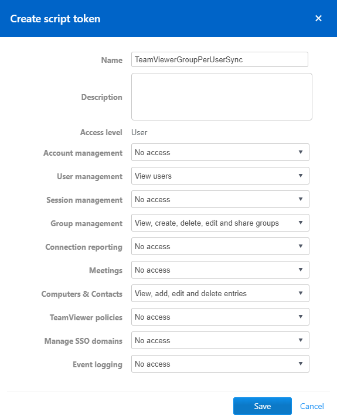

# TeamViewer Group Per User Sync

The script moves device entries from a common group to a shared group per
user. If such group doesn't exist, it will attempt to create the group.
Then it moves the device into that group and shares it with the respective
user. If the device is already present in the group or the group is already
shared with the user, the entry is skipped without doing any changes.

The caller needs to provider mapping data that maps a device to a user.
The data needs to be in CSV format and must have the following columns:

- `email`: The email of the user to map the device to.
- `device`: The alias of the device.
- `teamviewerid`: The TeamViewer ID of the device.

To resolve a certain device, the script prefers the TeamViewer ID over the
alias. The TeamViewer ID can also be left blank, so the script will only
try to resolve via the given device alias.

The created groups are named using the following pattern:
`Devices of user@example.test` (using the user's email address).

By default, this script writes log data to a file in the current working
directory using the following filename pattern:
`TeamViewerGroupPerUserSync.2020-03-11_17:00:00.log`
(using the date/time of the script invocation)

## Example Usages

```
.\Invoke-TeamViewerGroupPerUserSync -ApiToken 'MyApiToken' -MappingFilePath 'MyMappings.csv' -SourceGroupName 'My Computers'
```


```
.\Invoke-TeamViewerGroupPerUserSync -ApiToken 'MyApiToken' -MappingFilePath 'MyMappings.csv' -IgnoreSourceGroup
```

## Script Parameters

### `-ApiToken`

The TeamViewer API token to use.
Must be a user access token.
The token requires the following access permissions:

- *User management* : `View users`
- *Group management* : `View, create, delete, edit and share groups`
- *Computer & Contacts* : `View, add, edit and delete entries`



### `-MappingFilePath`

Path to the file that holds the mappings between users (email) and devices.
The file needs to be in CSV format (using "," comma delimiter) and must
provide the columns described above: email, device

### `-SourceGroupName`

The name of the group, where all devices are currently located.
If this parameter is set, only devices from that group are considered for
the sync.
Devices will be moved out of this group into the respective per-user groups.
Cannot be used in combination with the `IgnoreSourceGroup` parameter.

### `-IgnoreSourceGroup`

If set, there will be no restriction/filtering done on the current group of
devices. All devices of the account associated with the API token are
considered, regardless of their current group.

### `-NoLogFile`

Optionally, suppresses outputting log data to a file.
